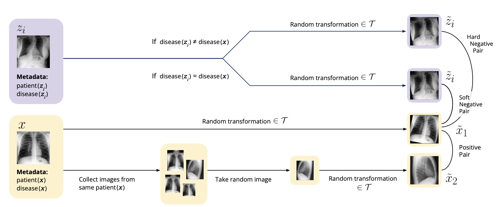

Multi Med
===

## About

We propose DisCeRn: Disease-Contrastive Representations from Multi-Modal Medical Data, a method for modifying contrastive loss by weighting negative pair of samples differently based on marginally related observed pathologies. The detailed project report can be found [here](https://github.com/tomginsberg/multimed/blob/master/ML4H_Project_Report%20.pdf). 

###### tags: `machine learning` `health` `self-supervised learning` 
